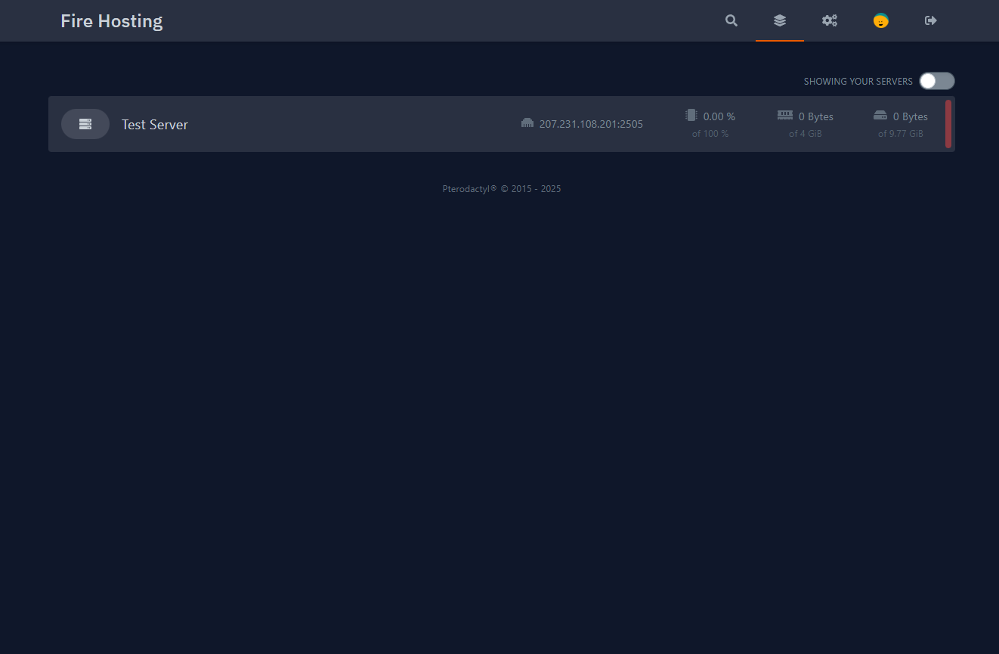

# How to Start a Minecraft Server

## Accessing the Panel

Once logged into the Fire Hosting panel, you will see a list of your servers.

* Click on **your Minecraft server** to view more information
* You will be redirected to the server management page

<figure><figcaption></figcaption></figure>

## Understanding the Console

On the server page, you will see a **large black block in the center of the screen**. This is the **server console**.

If you see the message:

`Server marked as offline...`

This means that your server is currently **stopped**.

<figure><figcaption></figcaption></figure>

## Starting the Server

1. To start the server, click the **"Start"** button located at the **top right** of the panel
2. After a few seconds, a message will appear asking you to **accept the Minecraft EULA**
3. You **must accept the EULA**, otherwise the server will not start

After accepting the EULA, the server will continue starting.

<figure><figcaption></figcaption></figure>

## Server Startup Behavior

* The startup process usually takes **1 to 2 minutes**
* During startup, you may notice **high CPU usage**
  * This is **normal** and only happens during initialization
  * CPU usage will decrease once the server is fully started

## Default Server Configuration

By default:

* The server is running **Vanilla Minecraft**
* No mods or plugins are installed
* The server is set to the **latest Minecraft version**

<figure><figcaption></figcaption></figure>

## Joining Your Minecraft Server

1. Launch **Minecraft Launcher** (official launcher or any compatible launcher)
2. Start Minecraft
3. From the main menu, select **Multiplayer**
4. Click on **Add Server**

Fill in the fields:

* **Server Name**: Any name you want (this is only for your personal list)
* **Server Address**: Enter the **IP address shown in the control panel**
  * You can find it at the **top right**, just below the **Start** button

5. Click **Done**

<figure><figcaption></figcaption></figure>

<figure><figcaption></figcaption></figure>

<figure><figcaption></figcaption></figure>

## Connecting to the Server

* Your server will now appear in the server list
* Select your server
* Click **Join Server**

🎮 You are now connected to your Minecraft server. Enjoy your game on **Fire Hosting**!

